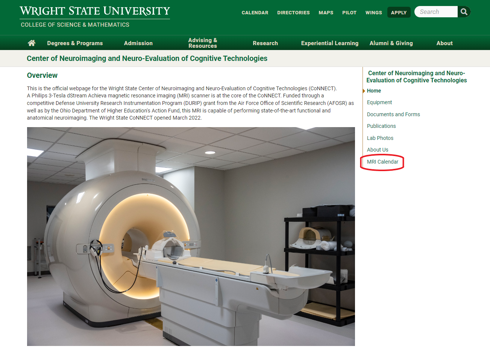
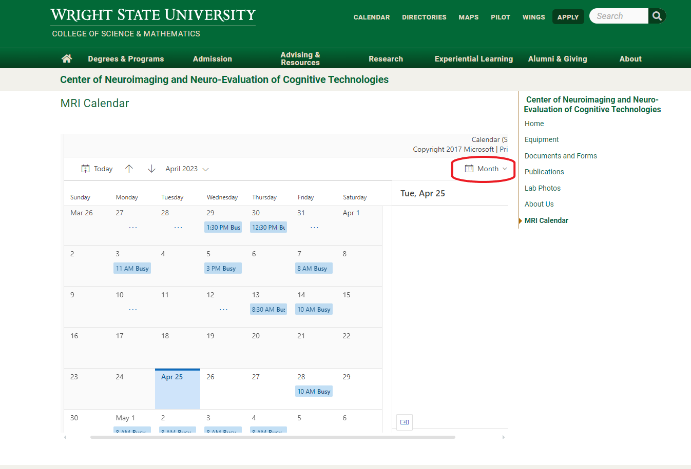
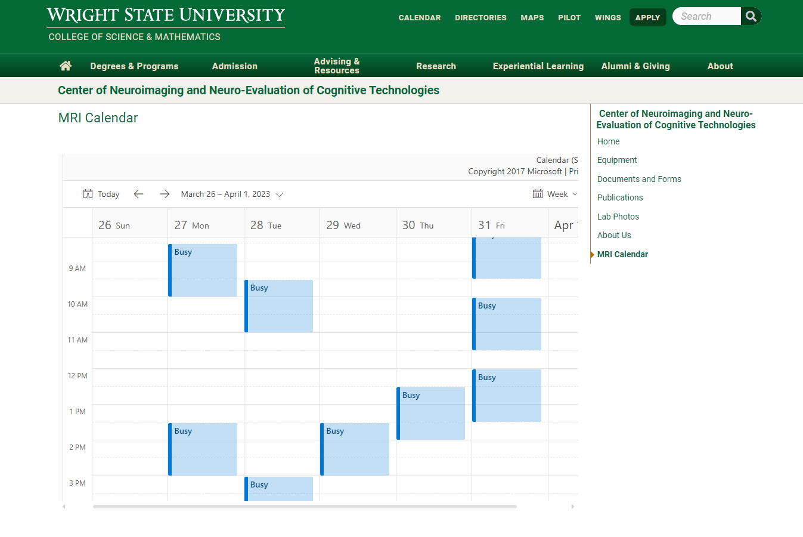
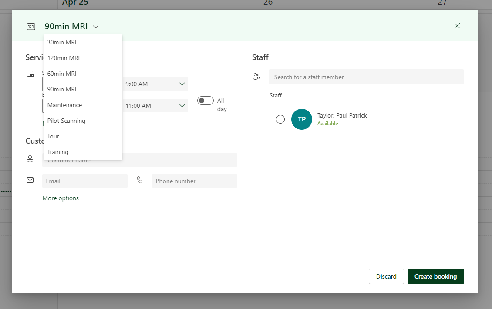
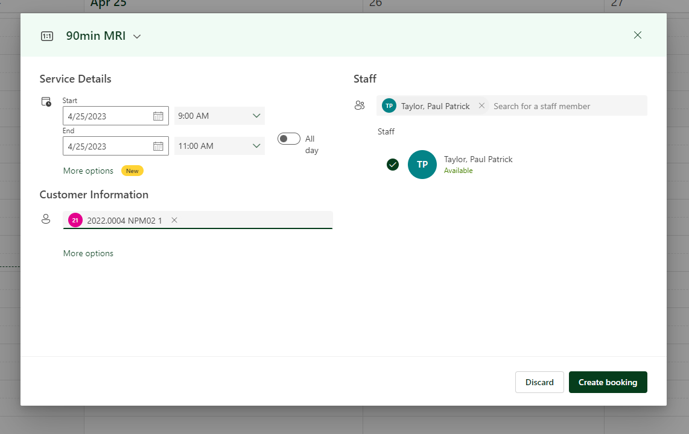

MRI Scheduling
**************

MRI Scheduling through wright.edu is as follows:

#. Start by going to the `CoNNECT laboratory website <https://science-math.wright.edu/lab/center-of-neuroimaging-and-neuro-evaluation-of-cognitive-technologies>`__. The introductory CoNNECT page should look like :numref:`booking step1`.

.. _booking step1:

   CoNNECT lab page on Wright State's campus website.

#. Select `MRI Calendar <https://science-math.wright.edu/lab/center-of-neuroimaging-and-neuro-evaluation-of-cognitive-technologies/mri-calendar>`__ on the banner to the right, highlighted in :numref:`booking step2`.

.. _booking step2:

   MRI Calender highlighted on the WSU CoNNECT lab website.

#. Once into the MRI Calender, select view by week on the drop down menu to the upper right quadrant of the calender.

   Dropdown menu to access week view.

Step 4: The MRI Calender will show available times for specific days.  If a specific time is available, and with the proper 
credentials awarded from WSU, continue to www.outlook.office.com/bookings/calender. If you are not affiliated with WSU, 
please reach out to the CoNNECT Staff and a Booking will be made on your behalf.

   MRI calender shown in week view.

Step 5: Once into bookings, select the desired date and time specified by the subject. A menu will be displayed, 
such as Figure 6. Choose the dropdown menu to specify the duration of the scan. Correct the time in Service Details if necessary. 

   Illustrates the drop down menu on the Bookings website. 

Step 6: Complete the Customer Information by stating the IRB number of the current project you are booking, followed by the project 
3 letter acronym, subject number, and session.  An example shown in Figure 8. 

   Showcasing the proper nomenclature when Booking subjects. 

Step 7: Ensure to choose the Staff member that is available for your specific scan time. 

Step 8: When Steps 1-7 have been completed, press 'Create Booking' to add to the MRI Calender.  To ensure you have adequately 
booked scan time, please visit www.wright.edu/connect-lab and search for your specified date and time.