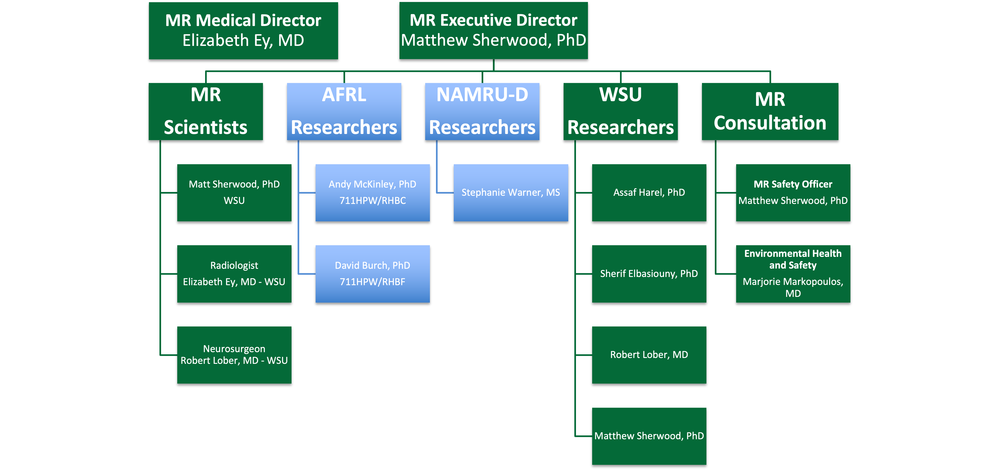

MRI Scheduling
**************

.. note:: To Be Developed

      
   CoNNECT Governing Board active organization chart.

MRI Scheduling through wright.edu is as follows:

Step 1: Start by going to wright.edu/connect-lab. The introductory CoNNECT page should look like Figure 2.

.. figure:: ./_images/wright.edu.connect-lab.PNG
   :align:  center
   :width:  100%

   Fig. 2 CoNNECT lab page on Wright State's 