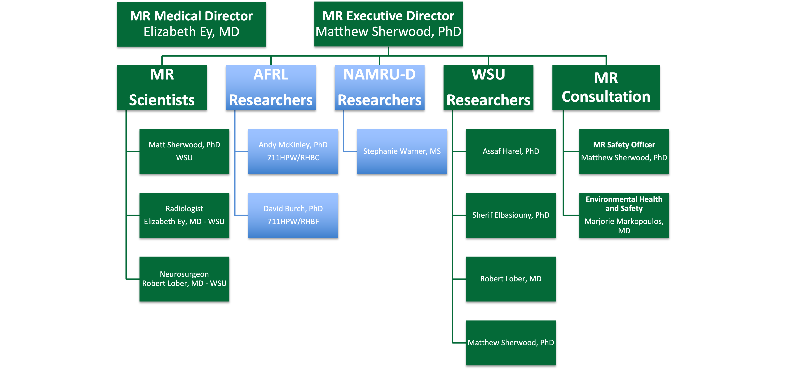

Governing Board
***************

The Governing Board is chaired by the executive director. The Governing Board includes staff and faculty members from Wright State but 
also external constituents from the US Air Force, US Navy and local clinical facilities. This Governing Board meets regularly to review 
policies and procedures, and to review any safety incidents.

   CoNNECT Governing Board active organization chart.