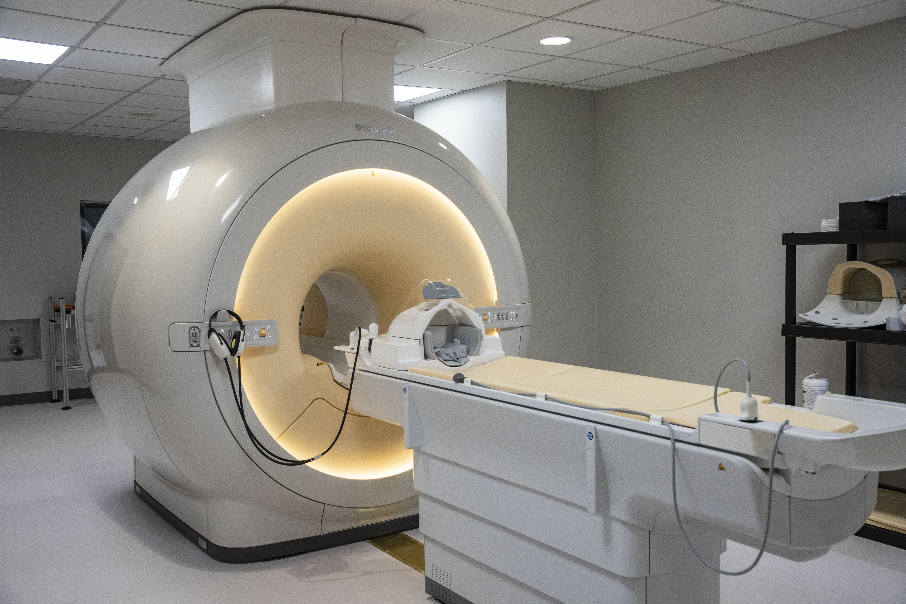

:topic: WSU CoNNECT

##################################
Welcome to the WSU's Center of Neuroimaging and Neuro-Evaluation of Cognitive Technologies
##################################

**CoNNECT** houses a 3.0-Tesla Philips Ingenia Cx MRI system with focused neuroimaging research applications.
This documentation describes the Data Management and Analysis pipelines that have been developed to ensure minimal 
data loss, expedited data processing and rapid project development.

   The Philips Ingenia Cx installed in the Neuroscience Engineering Building on Wright State's Dayton campus.

.. note::
   This manual is under active initial development.

Governing Board
===============

The Governing Board is chaired by the executive director. The Governing Board (see :numref:`org chart`) includes staff and faculty members from Wright State but 
also external constituents from the US Air Force, US Navy and local clinical facilities, and is led by CoNNECT Founding Director Dr. Matthew Sherwood. . This Governing Board meets regularly to review 
policies and procedures, and to review any safety incidents. 

.. _org chart:

.. figure:: ./_images/connect_org_chart.png
   :align: center
   :width: 50%
      
   CoNNECT Governing Board active organization chart.
   
.. sidebar::
   * :ref:`Administration <administration/index>`

.. toctree::
   :caption: **Table of Contents**
   :maxdepth: 2

   administration/index
   systems_overview/index
   cluster_computing/index
   broad_analysis_tools/index
   support_tools/index
   project-specific_JSON_control_files/index
   
