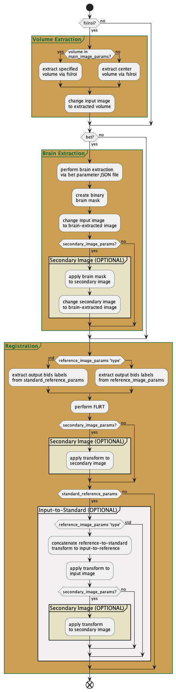

flirt.py
========

This support tool implements volume extraction (for 4D datasets), brain extraction, and/or registration via FSL's FLIRT. 
Specifically, this tools supports paralleled computation implemented from **connect_flirt**. A flowchart showing 
the order of operations is depicted in :numref:`flirt_diagram`. 

.. note:: 
    NEED TO PROVIDE A REFERENCE TO CONNECT_FLIRT.py

.. seealso:: 
    This support tool requires JSON control files to specify input parameters for `FLIRT <https://connect-tutorial.readthedocs.io/en/latest/project-specific_JSON_control_files/index.html#fmrib-s-linear-image-registration-tool-flirt>`__
    and any additional processing such as volume extraction and brain extraction. 

.. _flirt_diagram:

      
   Flowchart for the CoNNECT custom flirt.py batch processing support tool.

.. py:function:: flirt(IN_FILE,DATA_DIR,FLIRT_PARAMS,*args,**kwargs)
    
    This function performed FLIRT registration between secondary and/or standard (reference) images. Brain extraction will be 
    performed prior to registration on the input file if bet_params is specified.

    flirt(IN_FILE,DATA_DIR,FLIRT_PARAMS,overwrite=False,bet_params=None,progress=False)

    :param IN_FILE: REQUIRED String or pathlike object to an input NIfTI file.
    :param DATA_DIR: REQUIRED String or pathlike object to the project's data directory (project's 'dataDir' credential)
    :param FLIRT_PARAMS: REQUIRED String or pathlike object to the input file's FLIRT parameter file
    :param overwrite: OPTIONAL overwrite any existing files (default False) 
    :param bet_params: OPTIONAL String or pathlike object to the input file's BET parameter file (default None) 
    :param progress: OPTIONAL operate in verbose mode (default False) 
    :type IN_FILE: str or None or Pathlike object
    :type DATA_DIR: str or None or Pathlike object
    :type FLIRT_PARAMS: str or None or Pathlike object
    :type overwrite: bool
    :type bet_params: str or None or Pathlike object
    :type progress: bool
    :raise Error: If path does not exist.
    :return: None
    :rtype: None

flirt.py also supports execution via command-line:

.. code-block:: shell-session

    $ ./flirt.py <IN_FILE> <DATA_DIR> <FLIRT_PARAMS> --overwrite --bet-params <BET_PARAMS> --progress